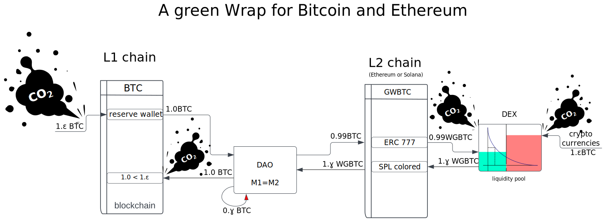

---
---
### Finally a Green Bitcoin

Bitcoin blockchain is burning an irresponsible amount of energy to deter fraud on the chain
leading to bad environment impact and high transaction fees.

In order to clean a "dirty" crypto, we are buying carbon credit and mint
an wrapped bitcoin on a carbon neutral chain.

This way we are avoiding the waste or energy and are using the minimum which is required to
settle the transaction on an ETH L2 chain.
All the deployed infrastructure supporting the network is carefully sized and distributed
for an optimal footprint.

Moreover you have the option
to participate the funding and governance of project that contribute
in the regeneration of the ecosystem, the biodiversity and other health
improvement, as well as zero waste economy (blue and purple industries).

This project is a genuine project (no Sybil here: my git commits are [signed][2] !)

### how it works:

1. you send your bitcoin to a "pool" address, each unspent transaction arriving in this pool
2. trigger the mint of a GreenWrapped-bitcoin (token) on Solana network  for the exact same value.
3. the very same token can be exchanged within the eco-system or eventually exchange on serum for
4. SOL or other cryptocurrencies (atomic swap). Time at which the token is destroy.

[2]: https://google.com/search?q=Michel+G.+Combes+z6CfPrhUVGwvMNCVMKtT7Nu1o5bGtpS4M8o5J4jGSMXJ
